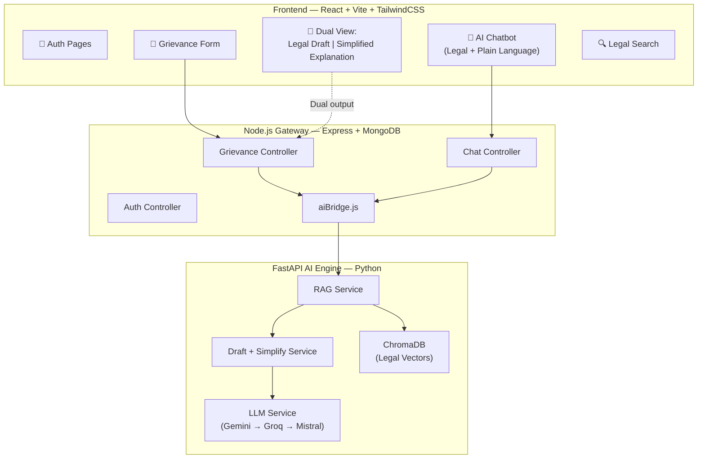
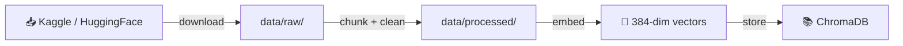
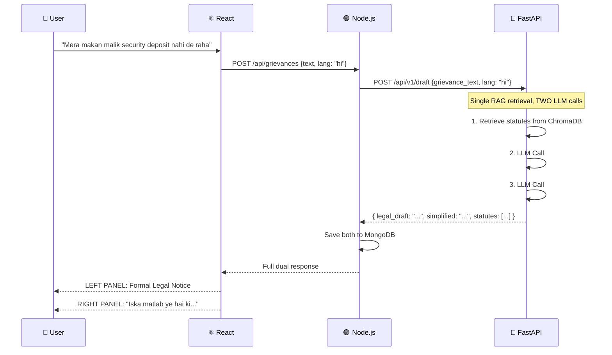

# NYAYA — Revised Implementation Plan (4-Day Sprint)

> **Deadline: August 23, 2026** | Start: Aug 19 evening | ~4 working days
> **Focus:** UP state laws + pan-India common laws | Hindi + English | TailwindCSS

---

## 1. Revised Architecture — Streamlined for 4 Days



> [!IMPORTANT]
> **Key Feature Change:** The Jargon Simplifier is **NOT** a separate module. It's built into:
> 1. **Grievance Flow** → Submit complaint → Get back **two panels**: formal legal draft + simplified explanation
> 2. **AI Chatbot** → Every answer includes **both** the legal response with statutes AND a plain-language "what this means for you" section

---

## 2. Revised Feature Map

| Feature | What It Does | Output |
|---|---|---|
| **Grievance Submission** | User describes problem in plain Hindi/English | Saves to MongoDB, triggers AI pipeline |
| **Legal Draft Generator** | RAG retrieves statutes → LLM drafts formal notice | Formal legal document (Panel 1) |
| **Integrated Simplifier** | Same RAG context → LLM explains in plain language | "What this means" explanation (Panel 2) |
| **AI Chatbot** | Follow-up Q&A with conversation memory | Dual response: legal answer + simplified version |
| **Legal Search** | Semantic search across embedded statutes | Ranked statute results with explanations |

---

## 3. Revised MVC Structure

### 3A. Node.js Backend (`/server`)

```
server/
├── package.json
├── .env
├── server.js
│
├── config/
│   └── db.js                     # Mongoose connection
│
├── models/
│   ├── User.js                   # name, email, passwordHash, preferredLang
│   ├── Grievance.js              # userId, plainText, category, legalDraft, simplifiedExplanation, statutes[]
│   ├── ChatHistory.js            # userId, sessionId, messages[{role, content, legalContent, simpleContent}]
│   └── LegalDraft.js             # userId, grievanceId, draftContent, simplifiedContent, statutes[], lang
│
├── controllers/
│   ├── authController.js         # register, login, getProfile
│   ├── grievanceController.js    # submit (→ aiBridge → dual response), getAll, getById
│   └── chatController.js         # sendMessage (→ aiBridge → dual response), getHistory
│
├── routes/
│   ├── authRoutes.js
│   ├── grievanceRoutes.js
│   └── chatRoutes.js
│
├── middleware/
│   ├── authMiddleware.js         # JWT guard
│   └── errorHandler.js
│
├── services/
│   └── aiBridge.js               # All FastAPI communication
│
└── utils/
    └── validators.js
```

### 3B. FastAPI AI Microservice (`/ai-service`)

```
ai-service/
├── requirements.txt
├── .env
├── main.py
│
├── app/
│   ├── api/v1/
│   │   ├── rag_routes.py         # POST /query — RAG Q&A (dual response)
│   │   ├── draft_routes.py       # POST /draft — generates draft + simplified
│   │   └── ingest_routes.py      # POST /ingest — document ingestion
│   │
│   ├── services/
│   │   ├── rag_service.py        # Core RAG: retrieve → prompt → generate
│   │   ├── draft_service.py      # Generates BOTH legal draft AND simplified explanation
│   │   ├── embedding_service.py  # HuggingFace embeddings
│   │   ├── chunking_service.py   # Text splitting for legal docs
│   │   └── llm_service.py        # Multi-provider: Gemini → Groq → Mistral
│   │
│   ├── db/
│   │   ├── chroma_client.py      # ChromaDB connection
│   │   └── vector_store.py       # Query/add interface
│   │
│   ├── core/
│   │   ├── config.py             # Pydantic Settings
│   │   └── security.py           # Inter-service API key
│   │
│   ├── prompts/
│   │   ├── draft_prompt.py       # Legal draft generation
│   │   ├── simplify_prompt.py    # Plain-language explanation
│   │   └── chat_prompt.py        # Chatbot (legal + simple combined)
│   │
│   └── schemas/
│       ├── query_schema.py
│       └── draft_schema.py
│
├── data/
│   ├── raw/                      # Downloaded datasets
│   └── processed/                # Chunked text
│
└── scripts/
    ├── download_datasets.py      # Automated download
    └── ingest_legal_data.py      # Chunk → embed → ChromaDB
```

---

## 4. Dataset Ingestion Pipeline — Step by Step

This is exactly how you bring legal datasets into your vector database.

### Step 1: Get the Datasets



#### From Kaggle (CLI):
```bash
# Install Kaggle CLI
pip install kaggle

# Set up API key: download kaggle.json from kaggle.com/account
# Place at ~/.kaggle/kaggle.json (Linux/Mac) or %USERPROFILE%\.kaggle\kaggle.json (Windows)

# Download BNS structured dataset
kaggle datasets download -d <dataset-slug>/bns-structured-dataset -p ./data/raw/

# Download BNS-IPC mapping
kaggle datasets download -d <dataset-slug>/bns-ipc-mapping -p ./data/raw/

# Unzip
unzip ./data/raw/*.zip -d ./data/raw/
```

#### From HuggingFace (Python):
```python
# scripts/download_datasets.py
from datasets import load_dataset

# BNS Law RAG Dataset — already formatted for RAG!
bns_dataset = load_dataset("path/to/bns-law-rag-dataset")
bns_dataset.save_to_disk("./data/raw/bns_rag")

# Indian Legal Corpus
ilc_dataset = load_dataset("path/to/indian-legal-corpus")
ilc_dataset.save_to_disk("./data/raw/ilc")

print(f"BNS columns: {bns_dataset['train'].column_names}")
print(f"BNS sample: {bns_dataset['train'][0]}")
```

### Step 2: Chunk the Documents

Legal documents are long. You must split them into digestible chunks that preserve legal meaning.

```python
# ai-service/app/services/chunking_service.py
from langchain.text_splitter import RecursiveCharacterTextSplitter

splitter = RecursiveCharacterTextSplitter(
    chunk_size=1000,         # ~250 words per chunk
    chunk_overlap=200,       # Overlap to preserve context across boundaries
    separators=[
        "\n\n",              # Paragraph breaks first
        "\n",                # Line breaks
        "Section ",          # Legal section boundaries
        "धारा ",             # Hindi section marker
        ". ",                # Sentence boundaries
        " ",
    ]
)

def chunk_document(text: str, metadata: dict) -> list[dict]:
    """Split a legal document into chunks with metadata."""
    chunks = splitter.create_documents(
        texts=[text],
        metadatas=[metadata]   # {source, section_number, act_name, language}
    )
    return [{"text": c.page_content, "metadata": c.metadata} for c in chunks]
```

### Step 3: Generate Embeddings

```python
# ai-service/app/services/embedding_service.py
from sentence_transformers import SentenceTransformer

# This model runs 100% locally — no API calls, no cost
model = SentenceTransformer("all-MiniLM-L6-v2")  # 384 dimensions

def embed_text(text: str) -> list[float]:
    """Embed a single text string."""
    return model.encode(text, normalize_embeddings=True).tolist()

def embed_batch(texts: list[str]) -> list[list[float]]:
    """Embed multiple texts efficiently."""
    return model.encode(texts, normalize_embeddings=True, batch_size=64).tolist()
```

### Step 4: Store in ChromaDB

```python
# scripts/ingest_legal_data.py
"""
ONE-TIME SCRIPT: Run this to populate ChromaDB with legal knowledge.
Usage: python scripts/ingest_legal_data.py
"""
import json
import os
from app.db.chroma_client import get_collection
from app.services.embedding_service import embed_batch
from app.services.chunking_service import chunk_document

# ── Load raw data ──
def load_bns_data():
    with open("./data/raw/bns_sections.json", "r", encoding="utf-8") as f:
        return json.load(f)  # [{section, title, description, punishment}, ...]

def load_ipc_mapping():
    with open("./data/raw/ipc_bns_mapping.json", "r", encoding="utf-8") as f:
        return json.load(f)  # [{ipc_section, bns_section, description}, ...]

# ── Ingest into ChromaDB ──
def ingest_collection(collection_name: str, documents: list[dict]):
    collection = get_collection(collection_name)
    
    all_chunks = []
    all_ids = []
    all_metadatas = []
    
    for i, doc in enumerate(documents):
        # Chunk each document
        text = doc.get("description") or doc.get("text") or str(doc)
        metadata = {
            "source": collection_name,
            "section": doc.get("section", ""),
            "title": doc.get("title", ""),
            "act": doc.get("act", collection_name),
            "language": doc.get("language", "en"),
        }
        
        chunks = chunk_document(text, metadata)
        for j, chunk in enumerate(chunks):
            all_chunks.append(chunk["text"])
            all_ids.append(f"{collection_name}_{i}_{j}")
            all_metadatas.append(chunk["metadata"])
    
    # Batch embed all chunks
    print(f"Embedding {len(all_chunks)} chunks for {collection_name}...")
    embeddings = embed_batch(all_chunks)
    
    # Store in ChromaDB
    collection.add(
        documents=all_chunks,
        embeddings=embeddings,
        ids=all_ids,
        metadatas=all_metadatas,
    )
    print(f"✅ Stored {len(all_chunks)} chunks in '{collection_name}'")

# ── Run ingestion ──
if __name__ == "__main__":
    # Ingest BNS sections
    bns_data = load_bns_data()
    ingest_collection("bns_sections", bns_data)
    
    # Ingest IPC-BNS mapping
    ipc_data = load_ipc_mapping()
    ingest_collection("ipc_bns_mapping", ipc_data)
    
    # Add more collections as needed:
    # ingest_collection("up_rent_control", load_up_rent_data())
    # ingest_collection("consumer_protection", load_consumer_data())
    # ingest_collection("rti_act", load_rti_data())
    
    print("\n🎉 All legal data ingested into ChromaDB!")
```

### Visual Summary of the Flow:

```
┌─────────────────────────────────────────────────────────────┐
│  DATASET INGESTION PIPELINE                                 │
│                                                             │
│  Kaggle/HuggingFace                                         │
│       │                                                     │
│       ▼                                                     │
│  data/raw/bns_sections.json     ← Download (CLI or Python)  │
│  data/raw/ipc_bns_mapping.json                              │
│  data/raw/up_specific_laws/                                 │
│       │                                                     │
│       ▼                                                     │
│  chunking_service.py            ← Split into 1000-char      │
│  (RecursiveCharacterTextSplitter)  chunks with 200 overlap  │
│       │                                                     │
│       ▼                                                     │
│  embedding_service.py           ← all-MiniLM-L6-v2          │
│  (SentenceTransformer)             384-dim vectors, LOCAL    │
│       │                                                     │
│       ▼                                                     │
│  ChromaDB (./chroma_db/)        ← Persistent, cosine sim    │
│  ├── bns_sections                                           │
│  ├── ipc_bns_mapping                                        │
│  ├── up_rent_control                                        │
│  ├── consumer_protection                                    │
│  └── rti_act                                                │
└─────────────────────────────────────────────────────────────┘
```

---

## 5. Dual-Output System — How the Merged Simplifier Works

### Grievance Flow (Dual Panel Response):



### Chatbot Flow (Dual Answer):

```
USER: "Section 406 BNS kya hai?"

CHATBOT RESPONSE:
┌──────────────────────────────────────────────────────────┐
│ ⚖️ LEGAL ANSWER                                         │
│ Section 406 of Bharatiya Nyaya Sanhita deals with       │
│ Criminal Breach of Trust. Whoever, being entrusted      │
│ with property or dominion over property, dishonestly    │
│ misappropriates or converts to his own use that         │
│ property, shall be punished with imprisonment...        │
│                                                         │
│ 📖 SIMPLE EXPLANATION (सरल भाषा में)                      │
│ अगर किसी ने आप पर भरोसा करके अपनी चीज़ या पैसा दिया,      │
│ और आपने उसे अपने लिए इस्तेमाल कर लिया — तो यह अपराध     │
│ है। इसमें 3 साल तक की जेल और जुर्माना हो सकता है।         │
│                                                         │
│ 🔜 WHAT TO DO NEXT                                      │
│ 1. FIR दर्ज करवाएं धारा 406 BNS के तहत                    │
│ 2. सबूत इकट्ठा करें (रसीद, बैंक स्टेटमेंट)                   │
│ 3. एक वकील से मिलें                                       │
└──────────────────────────────────────────────────────────┘
```

### Prompt Template for Dual Output:

```python
# ai-service/app/prompts/chat_prompt.py
CHAT_SYSTEM_PROMPT = """You are NYAYA, an AI legal assistant for Indian citizens,
specializing in UP state laws and pan-India laws (BNS, BNSS, BSA, Consumer 
Protection Act, RTI Act, Rent Control).

For EVERY response, you MUST provide THREE sections:

## ⚖️ Legal Answer
- Cite specific sections (BNS, BNSS, or relevant Act)
- Use proper legal terminology
- Be precise and accurate

## 📖 Simple Explanation (सरल भाषा में)
- Explain the same thing in plain {language}
- Use everyday examples
- No legal jargon — a 10th grader should understand this
- If language is Hindi, respond in Hindi script (Devanagari)

## 🔜 What To Do Next
- Give 3-5 actionable steps the person can take
- Include where to go (police station, court, consumer forum, etc.)
- Mention any deadlines or time limits

RULES:
- Respond in the SAME language the user used (Hindi or English)
- NEVER fabricate laws — only cite from provided context
- If unsure, say "कृपया एक वकील से सलाह लें" / "Please consult a qualified advocate"
"""
```

---

## 6. Compressed 4-Day Sprint Plan

### Day 1 — Aug 20 (Wednesday): Foundation 🏗️
> **Goal:** Both servers running, DB connected, auth working, ChromaDB populated.

| Time | Task |
|---|---|
| **Morning** | Initialize Node.js project: Express, Mongoose, JWT, bcrypt |
| | Create all Mongoose models (User, Grievance, LegalDraft, ChatHistory) |
| | Build auth flow: register → login → JWT middleware |
| | Connect to MongoDB Atlas |
| **Afternoon** | Initialize FastAPI project with full folder structure |
| | Set up ChromaDB with persistent storage |
| | Build `embedding_service.py` + `chunking_service.py` |
| | **Download & ingest legal datasets into ChromaDB** |
| **Evening** | Build `aiBridge.js` — test Node.js ↔ FastAPI ping |
| | Configure all `.env` files + get API keys (Gemini, Groq) |
| | **✅ Checkpoint:** Both servers run, user can register/login, ChromaDB has data |

---

### Day 2 — Aug 21 (Thursday): AI Engine + API Endpoints ⚙️
> **Goal:** RAG pipeline works end-to-end, all backend routes functional.

| Time | Task |
|---|---|
| **Morning** | Build `llm_service.py` (Gemini → Groq → Mistral fallback) |
| | Build `rag_service.py`: query embedding → ChromaDB retrieval → prompt |
| | Build `draft_service.py`: generates DUAL output (legal draft + simplified) |
| | Create all prompt templates (draft, simplify, chat) |
| **Afternoon** | Build FastAPI routes: `/query`, `/draft` |
| | Build Node.js grievance controller → aiBridge → FastAPI → dual response |
| | Build Node.js chat controller → aiBridge → dual response |
| | Build all Express routes with validation |
| **Evening** | Test full flow: submit grievance → get legal draft + simplified explanation |
| | Test chatbot: question → dual response (legal + simple) |
| | **✅ Checkpoint:** Postman/Thunder Client shows correct dual responses |

---

### Day 3 — Aug 22 (Friday): React Frontend 🎨
> **Goal:** Complete UI with all pages, connected to backend.

| Time | Task |
|---|---|
| **Morning** | Init React + Vite + TailwindCSS |
| | Build auth pages (Login, Register) |
| | Build Dashboard layout (sidebar navigation) |
| **Afternoon** | Build Grievance Form: category selector + text input |
| | Build **Dual Panel View**: Legal Draft (left) ↔ Simplified (right) |
| | Build AI Chatbot interface: message bubbles with dual-section responses |
| **Evening** | Build Legal Search page: semantic search bar + results |
| | Hindi/English language toggle |
| | Connect ALL frontend pages to backend APIs (axios/fetch) |
| | **✅ Checkpoint:** Full user flow works in browser |

---

### Day 4 — Aug 23 (Saturday): Deploy + Polish 🚀
> **Goal:** Live on the internet, polished, and demo-ready.

| Time | Task |
|---|---|
| **Morning** | Deploy FastAPI to Render (with ChromaDB data) |
| | Deploy Node.js to Render |
| | Deploy React to Vercel |
| | Configure environment variables on all platforms |
| **Afternoon** | Fix any deployment bugs (CORS, env vars, URLs) |
| | Add loading states, error messages, responsive design tweaks |
| | PDF download for legal drafts |
| **Evening** | Final end-to-end testing on live URLs |
| | Write README.md |
| | **✅ DONE: NYAYA is live!** |

---

## 7. Legal Data Sources for UP + India

| Dataset | Source | What It Contains | Format |
|---|---|---|---|
| **BNS Structured** | Kaggle | All 358 BNS sections | JSON |
| **BNS-IPC Mapping** | Kaggle (MIT) | Old IPC ↔ New BNS mapping | JSON |
| **BNS Law RAG Dataset** | HuggingFace | BNS, BNSS, BSA pre-processed for RAG | Text |
| **UP Rent Control Act** | IndiaCode.nic.in | UP-specific tenancy laws | PDF → Text |
| **Consumer Protection Act 2019** | IndiaCode.nic.in | Pan-India consumer rights | PDF → Text |
| **RTI Act 2005** | IndiaCode.nic.in | Right to Information | PDF → Text |
| **UP Revenue Code 2006** | UP Gov website | UP land/property laws | PDF → Text |
| **Indian Legal Corpus** | HuggingFace | Case summaries for context | Text |

> [!TIP]
> For PDFs from IndiaCode.nic.in, we'll use `PyPDF2` or `pdfplumber` to extract text, then run it through the chunking pipeline. I'll build this into the ingestion script.

---

## 8. Environment Variables

### Node.js (`server/.env`)
```env
PORT=5000
MONGO_URI=mongodb+srv://<user>:<pass>@cluster.mongodb.net/nyaya
JWT_SECRET=your_secret_here
JWT_EXPIRE=7d
FASTAPI_URL=http://localhost:8000
```

### FastAPI (`ai-service/.env`)
```env
GEMINI_API_KEY=your_key
GROQ_API_KEY=your_key
MISTRAL_API_KEY=your_key
CHROMA_PERSIST_PATH=./chroma_db
EMBEDDING_MODEL=all-MiniLM-L6-v2
INTER_SERVICE_KEY=shared_secret
```

---

## 9. ChromaDB Collections (Vector DB Schema)

```
chroma_db/
├── bns_sections          # 358 sections of Bharatiya Nyaya Sanhita
├── bnss_sections         # Bharatiya Nagarik Suraksha Sanhita (procedure)
├── bsa_sections          # Bharatiya Sakshya Adhiniyam (evidence)
├── ipc_bns_mapping       # Cross-reference old IPC ↔ new BNS
├── consumer_protection   # Consumer Protection Act 2019
├── rti_act              # Right to Information Act 2005
├── up_rent_control      # UP-specific rent/tenancy laws
├── up_revenue_code      # UP land and property laws
└── general_legal        # Miscellaneous legal knowledge
```

Each document in ChromaDB stores:
- `document`: The text chunk (≤1000 chars)
- `embedding`: 384-dim vector from all-MiniLM-L6-v2
- `metadata`: `{source, section, title, act, language, state}`

---

## 10. Deployment Architecture

```
┌─────────────────┐     ┌──────────────────┐     ┌──────────────────┐
│   Vercel         │     │   Render #1       │     │   Render #2       │
│   (Free)         │     │   (Free)          │     │   (Free)          │
│                  │     │                   │     │                   │
│   React +        │────▶│   Node.js +       │────▶│   FastAPI +       │
│   TailwindCSS    │     │   Express         │     │   ChromaDB        │
│                  │     │   ↕ MongoDB Atlas  │     │   ↕ LLM APIs      │
└─────────────────┘     └──────────────────┘     └──────────────────┘
```

> [!WARNING]
> **Render free tier** spins down after 15 min of inactivity. First request after sleep takes ~30 seconds. This is acceptable for a project demo but worth noting.

---

## Verification Plan

### After Each Day
- **Day 1:** `curl localhost:5000/api/auth/register` works, ChromaDB has >100 chunks
- **Day 2:** `curl localhost:5000/api/grievances` returns dual response with statutes
- **Day 3:** Browser shows full UI flow: login → submit grievance → see dual panel
- **Day 4:** Live URLs work, full demo flow end-to-end

### Final Acceptance Test
Submit this grievance in Hindi:
> "मेरे मकान मालिक ने 6 महीने से सिक्योरिटी डिपॉजिट वापस नहीं किया है, 50,000 रुपये थे"

**Expected output:**
- **Left Panel:** Formal legal notice citing BNS §406 (Criminal Breach of Trust) + UP Rent Control provisions
- **Right Panel:** Plain Hindi explanation of what these sections mean + 5 steps to take next
